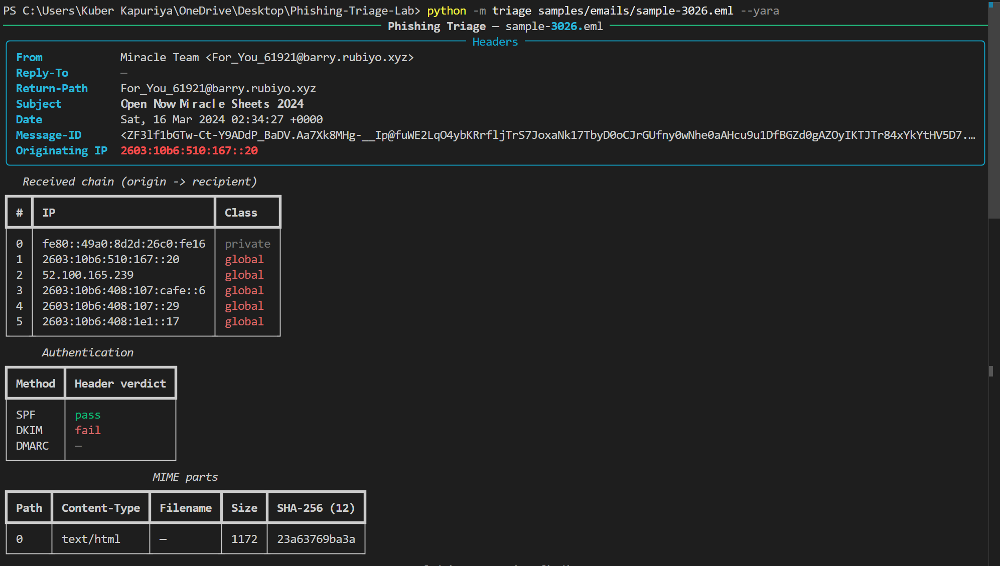
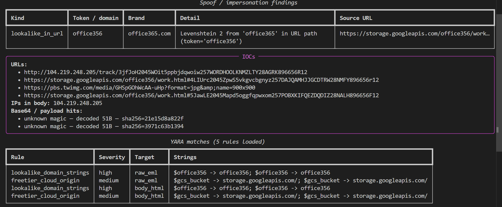

# Phishing Email Triage Lab

A Python toolchain for analyzing real phishing emails end-to-end. Five real samples are dissected in [`reports/`](reports/); aggregate findings are in [`reports/findings_summary.md`](reports/findings_summary.md).

The tool ingests an `.eml`, walks the SMTP / MIME structure, applies regex + YARA detections, and enriches IOCs against PhishTank (via the public Phishing.Database mirror) and urlscan.io. Every claim in this README maps to a file in the repo.

```
python -m triage samples/emails/<file>.eml --yara --live-dns --phishtank --urlscan
```

## What it does

| Step | Module | Output |
|---|---|---|
| 1. Parse SMTP headers | [`triage/header_parser.py`](triage/header_parser.py) | `Received:` chain ordered origin → recipient, originating external IP (RFC 5737 documentation ranges excluded), From / Reply-To / Return-Path divergence |
| 2. Validate authentication | [`triage/auth_validator.py`](triage/auth_validator.py) | SPF / DKIM / DMARC verdicts from `Authentication-Results`, plus optional fresh `dnspython` lookup of SPF and DMARC TXT records on the From-domain |
| 3. Walk MIME structure | [`triage/mime_walker.py`](triage/mime_walker.py) | One `Part` per leaf with content-type, charset, filename, size, SHA-256, decoded payload bytes |
| 4. Detect spoofing | [`triage/spoof_detector.py`](triage/spoof_detector.py) | (a) Executive impersonation by display-name title; (b) display-name brand spoof against a protected-brands list; (c) lookalike From-domain via homoglyph + Levenshtein + suspicious-TLD swap; (d) lookalike-in-URL — same logic applied to host, subdomain, and path segments of every URL extracted |
| 5. Extract IOCs | [`triage/payload_extractor.py`](triage/payload_extractor.py) | URLs (deobfuscating `hxxp` / `[.]` / `<>` / quoted-printable), email addresses, IPs, base64 blobs with magic-byte sniffing (PE / ZIP / PDF / HTML / Office / etc.) |
| 6. Apply YARA rules | [`triage/yara_runner.py`](triage/yara_runner.py) + [`rules/`](rules/) | 5 rule files; rules scan against raw `.eml`, body text, body HTML, and each decoded attachment |
| 7. Cross-reference PhishTank | [`triage/phishtank_client.py`](triage/phishtank_client.py) | Lookup against the [`mitchellkrogza/Phishing.Database`](https://github.com/mitchellkrogza/Phishing.Database) public mirror (PhishTank-derived; no API key needed since PhishTank registration was paused in 2024 — see [`docs/PHISHTANK_NOTE.md`](docs/PHISHTANK_NOTE.md)) |
| 8. Submit to urlscan.io | [`triage/urlscan_client.py`](triage/urlscan_client.py) | Submit each URL with `visibility=unlisted`, poll the result endpoint, capture verdict, score, screenshot URL, result-page URL; on-disk cache by URL hash |
| 9. Render report | [`triage/cli.py`](triage/cli.py) | Pretty terminal output (rich) or markdown report following [`reports/_template.md`](reports/_template.md) |

## Highlights from the 5 deep-dive analyses

- **Authentication is not a useful filter.** 4/5 samples passed SPF, 3/5 passed DKIM and DMARC — yet all 5 are clearly malicious. Modern phishing kits engineer themselves to pass authentication by relaying through real free mailboxes (Gmail) or laundering through free Azure tenants (`*.onmicrosoft.com`).
- **Display-name brand spoof was the dominant evasion (3/5 samples).** Detected by extending the spoof detector to compare display-name tokens against a protected-brands list — see [sample 1](reports/sample_01_docusign_brand_spoof.md) (DocuSign), [sample 4](reports/sample_04_aave_defi_rewards.md) (Aave), [sample 5](reports/sample_05_omaha_steaks_typosquat.md) (Omaha Steaks).
- **Brand impersonation now lives in URL paths, not just hosts.** [Sample 2](reports/sample_02_office365_path_squat.md) hosts `office356/work.html` on a public Google Cloud Storage bucket — `office356` is Levenshtein 2 from `office365`. The path-aware lookalike check (`detect_lookalike_in_urls`) catches it where a host-only check would not.
- **Unicode evasion of subject keywords.** Sample 2's subject is 100% Mathematical Sans-Serif Bold characters (U+1D5D4–U+1D607); a CyberChef NFKC normalisation reveals the underlying ASCII.
- **Free-tier cloud abuse is a high-precision signal.** Return-Path on `*.onmicrosoft.com` paired with a from-domain claiming a known consumer brand (sample 5 — "Omaha Steaks") is near-100% phishing.

Full breakdown in [`reports/findings_summary.md`](reports/findings_summary.md).

A separate **live-kit demonstration** report — [`reports/live_demo_edgeone_files_collection.md`](reports/live_demo_edgeone_files_collection.md) — captures the toolchain enriching a *currently-live* (HTTP 200, fully-rendered) phishing kit hosted on Tencent EdgeOne. The 5 historical samples have all been taken down; the live demo gives a side-by-side example of what the same enrichment looks like against an active kit.

## Screenshots

CLI output running on a real sample:




## Quick start

```powershell
# 1. Install
pip install -r requirements.txt

# 2. Configure (urlscan.io API key only — PhishTank API is paused, we use the public mirror)
copy .env.example .env
# edit .env, paste your urlscan.io key (https://urlscan.io/user/signup)

# 3. Fetch sample corpus (~2k real phishing emails from rf-peixoto/phishing_pot, MIT-licensed)
python scripts/fetch_samples.py --count 50

# 4. Triage one sample
python -m triage samples/emails/<file>.eml --yara

# 5. Full enrichment (live SPF/DMARC, PhishTank, urlscan.io submission)
python -m triage samples/emails/<file>.eml --yara --live-dns --phishtank --urlscan

# 6. Generate a markdown deep-dive report
python -m triage samples/emails/<file>.eml --yara --report-md > reports/sample_NN.md

# 7. Submit a single URL to urlscan.io ad-hoc
python scripts/submit_urlscan.py "https://suspicious-url.example.com/foo"
```

## Repository layout

```
triage/
  cli.py                 # `python -m triage <eml>` entry point
  header_parser.py       # Received-chain walk, originating-IP, address divergence
  auth_validator.py      # SPF/DKIM/DMARC parse + optional live DNS
  mime_walker.py         # recursive MIME tree + per-part hashes
  spoof_detector.py      # exec impersonation, display-name brand spoof,
                         # lookalike domain (homoglyph/Levenshtein/TLD), lookalike-in-URL
  payload_extractor.py   # URL/email/IP/base64 extraction with magic-byte sniffing
  phishtank_client.py    # Phishing.Database public mirror lookups + 24h cache
  urlscan_client.py      # urlscan.io submit/poll with on-disk cache
  yara_runner.py         # compile + scan against 4 buffer types per sample
  data/
    protected_brands.txt
    known_domains.txt    # org allowlist (per-deployment)
rules/
  exec_impersonation.yar
  lookalike_domains.yar      # includes freetier_cloud_origin rule
  base64_payloads.yar        # PE / ZIP / PDF / HTML smuggling
  credential_phish.yar       # login lures, DocuSign, crypto, retail
  suspicious_attachments.yar # extensions, double-extension, finance-PDF
reports/
  _template.md
  sample_01_docusign_brand_spoof.md
  sample_02_office365_path_squat.md
  sample_03_btc_mining_pdf.md
  sample_04_aave_defi_rewards.md
  sample_05_omaha_steaks_typosquat.md
  findings_summary.md
docs/
  METHODOLOGY.md         # full analysis workflow
  CYBERCHEF_RECIPES.md   # 6 reusable recipe URLs
  PHISHTANK_NOTE.md      # honest sample-source / mirror explanation
scripts/
  fetch_samples.py       # clone phishing_pot, copy N random .eml files
  submit_urlscan.py      # one-off URL submission
tests/
  fixtures/synthetic_sample.eml
  test_*.py              # 31 pytests over a synthetic .eml
samples/                 # gitignored — fetched on demand
```

## Tests

```powershell
python -m pytest tests/
```

31 tests pass against a synthetic `.eml` fixture. Tests cover header parsing, auth validation, MIME walking, IOC extraction (including obfuscated URLs), all four spoof detectors, and YARA rule compilation + matching.

## A note on PhishTank

PhishTank paused new API registrations in 2024. This project cross-references against PhishTank data via two routes that don't require a key:

1. **Programmatic** — pulls the PhishTank-sourced active-URL list from [`mitchellkrogza/Phishing.Database`](https://github.com/mitchellkrogza/Phishing.Database), a public auto-updated mirror.
2. **Manual** — `phishtank.org/phish_search.php` web search, performed for each deep-dive (links in each report).

See [`docs/PHISHTANK_NOTE.md`](docs/PHISHTANK_NOTE.md) for full context.

## License

Personal portfolio project. The `phishing_pot` corpus is MIT-licensed by its authors; sample emails are not redistributed in this repo.
